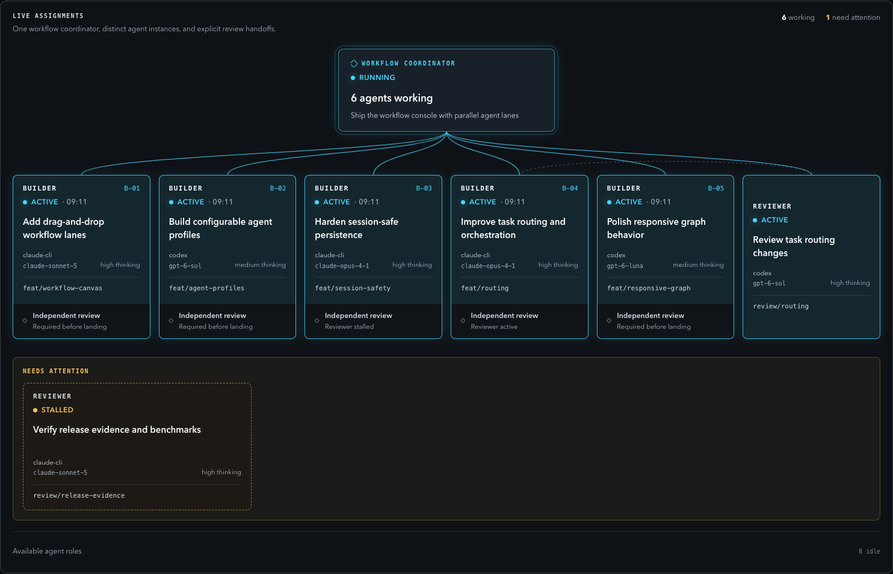

# DevSupervisor

A supervisor for autonomous software work. Give it a goal; it plans the work,
hands each piece to a disposable agent, has an independent reviewer check the
result, lands what passes, and stops for you when a decision is genuinely
yours. State lives in SQLite, not in the conversation.



## Quick start

```bash
git clone git@github.com:nTony46/DevSupervisor.git
export PATH="$PWD/DevSupervisor/bin:$PATH"     # add to your shell profile
devsup doctor

devsup init ~/path/to/your-repo --name myproject
devsup claude-md ~/path/to/your-repo            # creates CLAUDE.md, or appends to yours
```

Now open Claude Code in your repo and give it a task as you normally would:

```
Add prose-search fallback for identifiers that miss the index. Budget $20.
Stop and ask if the fix needs a threshold you would have to guess.
```

The `CLAUDE.md` is what tells the session to use DevSupervisor — you don't
have to say so in each prompt, and without it nothing is automatic. The
session registers the task as a goal, plans it, runs the loop within your
budget, and brings every human decision back to you as a gate. What comes back
is a landed SHA, what was verified, and what it cost.

**Nothing spends money unless you name a budget.** The default provider is a
free deterministic mock, and the `CLAUDE.md` forbids `--allow-paid` unless you
said the work may spend.

## The commands underneath

The session runs these for you; you can run them yourself at any time.

```bash
devsup goal add myproject "…" --criteria "…"
devsup plan <goal-id>
devsup run myproject --dry-run
devsup run myproject --provider claude-cli --allow-paid --budget 20
devsup gates                              # decisions waiting on you
devsup approve|reject <gate-id> --actor you
devsup status | jobs | job show <id>
```

Also: `devsup pause|resume`, `devsup memory list|curate|adopt`,
`devsup retrospect`, `devsup dashboard`.

## Dashboard

```bash
devsup dashboard        # http://127.0.0.1:8765
```

Read-only, loopback only. Pipeline, live agent graph, activity log, gates,
spend — all derived from durable state, so it survives restarts. A project
selector appears once more than one project is registered.

## Project rules: policy packs

Rules specific to one repository — protected paths, a required verification
command, extra hard rules, risk floors, subjects that must open a gate — live
in a *policy pack*, outside the core. Copy
`devsupervisor/policy/packs/example.py` to `~/.devsupervisor/packs/<name>.py`,
edit it, and pass `--pack <name>` to `devsup init`.

## How it works

```
┌──────────────────────────────────────────────┐
│  DETERMINISTIC HARNESS (Python, no model)    │
│  state machine · scheduler · leases · gates  │
│  policy · persistence · metrics · CLI        │
└───────────────┬──────────────────────────────┘
                │ job packets          ▲ results
                ▼                      │
┌──────────────────────────────────────────────┐
│  PROVIDER (mock | claude-cli)                │
│  disposable agent processes                  │
└──────────────────────────────────────────────┘
```

The split is simple: **the model does the thinking, plain Python does the
bookkeeping.** The model breaks a goal into jobs, writes the code, and writes
the review. Python tracks which job is in which state, retries failures, makes
sure two workers never grab the same job, opens a gate when a human has to
decide, checks that a change is safe to land, strips secrets, and counts the
money. None of that is left to the model's judgment, because a wrong answer
there is a bug, not a bad opinion.

Each cycle of `devsup run` does the same thing: take a job that's ready, write
it a self-contained brief, start a fresh `claude -p` in its own git worktree,
read the structured result it reports back, and move the job to its next
state. Your Claude Code session is the operator that starts these cycles and
relays gates to you; the workers are separate processes that never see your
conversation. `devsup resume` picks up every project from where it left off,
with no session at all.

Three guarantees are built into the state machine, so no prompt can talk it
out of them:

- the agent that wrote a change can never be the one that approves it;
- a job that requires review cannot skip review;
- an approved change is not "done" until it has actually landed and been verified.

<details>
<summary>Agent roles</summary>

| Role | Does | Trust |
|---|---|---|
| `investigator` | reproduces, baselines; changes nothing | disposable |
| `planner` | turns a goal into a contract | privileged |
| `architect` | writes the design and the rejected alternatives | disposable |
| `build` | implements in its own worktree; returns a SHA | disposable |
| `reviewer` | independent APPROVE/REJECT; may not fix what it reviews | disposable, critical |
| `specialist` / `security` | risk-specific review | disposable, critical |
| `qa` | proves behaviour unchanged against a baseline | disposable |
| `landing` | lands the exact approved SHA, runs verification | privileged |
| `evaluator` | asks whether the *goal* is met | disposable, critical |
| `researcher` / `operator` | evidence gathering; experiment runs | disposable / privileged |
| `supervisor` | the outer loop | privileged, critical |

*Disposable* roles work in throwaway worktrees and touch shared state only
through a later, separately authorised step. *Privileged* roles act on shared
state, bounded by deterministic checks. *Critical* roles have a model-routing
floor a learnable policy may raise but not lower.
</details>

<details>
<summary>Repository layout</summary>

```
devsupervisor/
  state/       SQLite schema, state machine, store, leases
  memory/      path-addressed docs, redaction, curation
  context/     the job-packet compiler
  planner/     goal → plan DAG, workflow templates, risk
  policy/      immutable rules, learnable policy, project packs
  providers/   agent runtimes (mock, claude-cli)
  dashboard/   the read-only localhost UI
  scheduler.py supervisor.py metrics.py retrospective.py cli.py
docs/          architecture and the frozen spec
tests/         acceptance suite (stdlib unittest, no network)
examples/      a sample project fixture
templates/     the CLAUDE.md that `devsup claude-md` installs
```
</details>

## State, tests, limits

Everything durable lives under `$DEVSUPERVISOR_HOME` (default
`~/.devsupervisor`); point it at a temp directory for an isolated instance.

`./scripts/test.sh` — 414 tests, no network, no paid calls.

Local, single machine, one supervisor loop at a time. Providers: `mock` and
`claude-cli` (needs `claude` on `PATH`). Runs from a checkout; no package yet.
Git-based landing on a clean tree. macOS/Linux.

## Docs

[architecture](docs/architecture.md) ·
[state model](docs/state-model.md) ·
[agent loops](docs/agent-loop.md) ·
[context and memory](docs/context-and-memory.md) ·
[execution policy](docs/execution-policy.md) ·
[model routing](docs/model-routing.md) ·
[safety and human gates](docs/security-and-human-gates.md) ·
[acceptance tests](docs/acceptance-tests.md) ·
[bootstrap log](docs/BOOTSTRAP_LOG.md)

## License

MIT — see [LICENSE](LICENSE).
